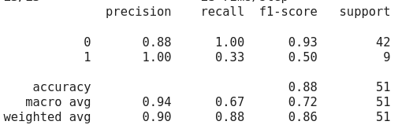

# COVID-19 Medical Image Classification Using Transfer Learning

## Project Overview
This project demonstrates the application of advanced deep learning techniques to tackle a critical healthcare challenge: the automated classification of medical images for COVID-19 diagnosis. Using transfer learning approaches with state-of-the-art convolutional neural network architectures (ResNet, VGG16, and VGG19), this solution addresses the real-world constraints of limited data availability and class imbalance in medical imaging datasets.

## Technical Highlights
- **Transfer Learning Implementation**: Leveraged pre-trained models (ResNet, VGG16, VGG19) on ImageNet dataset, adapting them for medical image classification through strategic fine-tuning of specific layers
- **Imbalanced Dataset Handling**: Developed solutions for a significantly skewed dataset (about 1:8 ratio of normal to COVID-19 cases) using sampling and weighting techniques
- **Deep Learning Framework**: Utilized TensorFlow for model implementation, demonstrating proficiency in industry-standard deep learning tools
- **Medical Image Processing**: Applied specialized preprocessing techniques suitable for medical imaging data

## Challenge and Approach
The primary challenge in this project was developing a reliable classification model with a small, imbalanced dataset - a common scenario in medical imaging projects. Instead of training from scratch, which would require vast amounts of data, I implemented a transfer learning strategy that capitalizes on pre-trained models' feature extraction capabilities while fine-tuning specific layers for our medical imaging context.

## Skills Demonstrated
- Deep Learning Architecture Design
- Transfer Learning Implementation
- Medical Image Processing
- Handling Imbalanced Datasets
- TensorFlow/Keras Framework Proficiency
- Model Performance Optimization
- Healthcare AI Applications

## Impact and Applications
This project showcases the practical application of computer vision techniques in healthcare, demonstrating how deep learning can be effectively deployed even with limited data resources. The approach developed here can be extended to other medical imaging classification tasks where data scarcity and class imbalance are common challenges.

## Main Project Results

The screenshot below show that the male sex is predominant in this dataset.

The screenshot below points out that in this dataset the age distribution of the patients is more gaussian-like for males, while it is highly right-skewed for females, specially for females with age around 70 years.

The screenshot below shows a grid of (5x5) randomly chosen COVID X-Ray Images, which is meaning for the medic and essential for deep learning models in order to learn patterns for diagnosizing whether a given X-ray image is a COVID-19 case or not.

After dataset cleaning, the screenshot below shows the number of normal and COVID-19 X-ray images presented in the dataset. From this figure, it can be noticed that the classes are highly imbalanced, what makes the problem more challenging.

Several pre-trained models were trained and fine-tuned in order to find the most suitable model for this dataset. Among the attempted models, ResNet, VGG16, and VGG19 were trained and the best result was obtained for the VGG19 model by using weights from imagenet.

After training the deep learning (VGG19) for 10 epochs by using a batch size of 4 images, below is shown a screenshot of the training and validation accuracies, from which the best model can be chosen automatically by presenting the highest validation accuracy, along with a consistent training accuracy.

Below it is shown the classification metrics on the test set, demonstrating it has good performance in the majority class (COVID-19 diagnoses), although presenting a reasonable performance in the minority class (normal diagnosis) according to the f1-score metrics. This reduced performance on the minority class might be related to the high class imbalance presented in the dataset, affecting the model learning for this specific class.  

The screenshot below shows the explicit confusion matrix of the best model in the test set, from which it is explicit that model was not able to learn very well the normal diagnosis pattern. In production, this result point out that normal diagnoses might be mistaken by COVID-19 cases and, so, these patients would receive COVID-19 treatment without needing it. However, the results here presented point out that all the patients suffering from COVID-19 would be correctly diagnosed and get the proper treatment, which is a good feature of this particular deep learning model. 

# Contributor Covenant Code of Conduct

## Our Pledge

We as members, contributors, and leaders pledge to make participation in our
community a harassment-free experience for everyone, regardless of age, body
size, visible or invisible disability, ethnicity, sex characteristics, gender
identity and expression, level of experience, education, socio-economic status,
nationality, personal appearance, race, caste, color, religion, or sexual
identity and orientation.

We pledge to act and interact in ways that contribute to an open, welcoming,
diverse, inclusive, and healthy community.

## Our Standards

Examples of behavior that contributes to a positive environment for our
community include:

* Demonstrating empathy and kindness toward other contributions that are not aligned with this Code of Conduct, and will communicate reasons for moderation decisions when appropriate.

## Scope

This Code of Conduct applies within all community spaces, and also applies when
an individual, or aggression toward or disparagement of classes of individuals.

**Consequence**: A permanent ban from any sort of public interaction within the
community.

## Attribution

This Code of Conduct is adapted from the [Contributor Covenant][homepage],
version 2.1, available at
[https://www.contributor-covenant.org/version/2/1/code_of_conduct.html][v2.1].

Community Impact Guidelines were inspired by
[Mozilla's code of conduct enforcement ladder][Mozilla CoC].

For answers to common questions about this code of conduct, see the FAQ at
[https://www.contributor-covenant.org/faq][FAQ]. Translations are available at
[https://www.contributor-covenant.org/translations][translations].

[homepage]: https://www.contributor-covenant.org
[v2.1]: https://www.contributor-covenant.org/version/2/1/code_of_conduct.html
[Mozilla CoC]: https://github.com/mozilla/diversity
[FAQ]: https://www.contributor-covenant.org/faq
[translations]: https://www.contributor-covenant.org/translations is officially representing the community in public spaces.
Examples of representing our community include using an official e-mail address,
posting via an official social media account, or acting as an appointed
representative at an online or offline event.

## Enforcement

Instances of abusive, harassing, or otherwise unacceptable behavior may be
reported to the community leaders responsible for enforcement at
[INSERT CONTACT METHOD].
All complaints will be reviewed and investigated promptly and fairly.

All community leaders are obligated to respect the privacy and security of the
reporter of any incident.

## Enforcement Guidelines

Community leaders will follow these Community Impact Guidelines in determining
the consequences for any action they deem in violation of this Code of Conduct:

### 1. Correction

**Community Impact**: Use of inappropriate language or other behavior deemed
unprofessional or unwelcome in the community.

**Consequence**: A private, written warning from community leaders, providing
clarity around the nature of the violation and an explanation of why the
behavior was inappropriate. A public apology may be requested.

### 2. Warning

**Community Impact**: A violation through a single incident or series of
actions.

**Consequence**: A warning with consequences for continued behavior. No
interaction with the people involved, including unsolicited interaction with
those enforcing the Code of Conduct, for a specified period of time. This
includes avoiding interactions in community spaces as well as external channels
like social media. Violating these terms may lead to a temporary or permanent
ban.

### 3. Temporary Ban

**Community Impact**: A serious violation of community standards, including
sustained inappropriate behavior.

**Consequence**: A temporary ban from any sort of interaction or public
communication with the community for a specified period of time. No public or
private interaction with the people involved, including unsolicited interaction
with those enforcing the Code of Conduct, is allowed during this period.
Violating these terms may lead to a permanent ban.

### 4. Permanent Ban

**Community Impact**: Demonstrating a pattern of violation of community
standards, including sustained inappropriate behavior, harassment of an
individual people
* Being respectful of differing opinions, viewpoints, and experiences
* Giving and gracefully accepting constructive feedback
* Accepting responsibility and apologizing to those affected by our mistakes,
  and learning from the experience
* Focusing on what is best not just for us as individuals, but for the overall
  community

Examples of unacceptable behavior include:

* The use of sexualized language or imagery, and sexual attention or advances of
  any kind
* Trolling, insulting or derogatory comments, and personal or political attacks
* Public or private harassment
* Publishing others' private information, such as a physical or email address,
  without their explicit permission
* Other conduct which could reasonably be considered inappropriate in a
  professional setting

## Enforcement Responsibilities

Community leaders are responsible for clarifying and enforcing our standards of
acceptable behavior and will take appropriate and fair corrective action in
response to any behavior that they deem inappropriate, threatening, offensive,
or harmful.

Community leaders have the right and responsibility to remove, edit, or reject
comments, commits, code, wiki edits, issues, and other